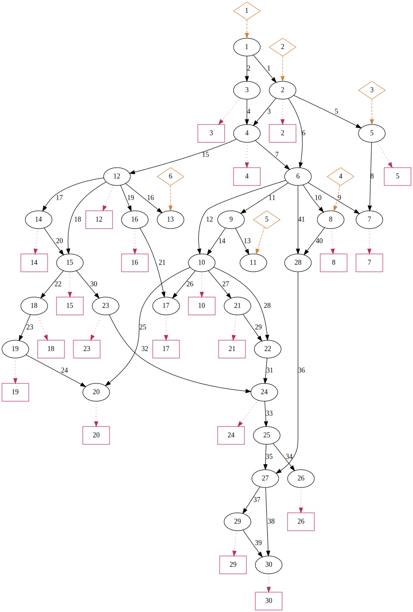

# Random Permutations of Contingency Sequences

## Results

| NESTA 30 IEEE                                                   | NESTA 118 IEEE                                                    |
|-----------------------------------------------------------------|-------------------------------------------------------------------|
|  |  |
|  |  |
|      |  |
|  [nesta_case30_ieee/graph.dot](nesta_case30_ieee/graph.dot)     |  [nesta_case118_ieee/graph.dot](nesta_case118_ieee/graph.dot) |

## Key to Directories and Files

### Directories

Each directory contains contingency cases for a different network.

### Files

| File             | Description                    |
|------------------|--------------------------------|
| graph.dot        | GraphViz .dot file for network |
| graph.svg        | SVG image of network           |
| branches.tsv     | line/transformer connectivity  |
| loads.tsv        | load connectivity              |
| generators.tsv   | generator connectivity         |
| results-*i*.tsv  | results of contigency case *i* |

### Fields in results files

The row with `Sequence = -1` and `Status = "LIMITS"` shows the maximum allowed values fro the flows, generation, and consumption.

| Field    | Description                                |
|----------|--------------------------------------------|
| Sequence | Number of node contingencies               |
| Status   | Whether the solution was successful        |
| b\_*i*   | Whehter bus *i* is in service              |
| f\_*i*   | Whether line/transformer *i* is in service |
| g\_*i*   | Whether load *i* is in service             |
| F\_*i*   | Per-unit flow in line/transformer *i*      |
| G\_*i*   | Per-unit generation at generator *i*       |
| L\_*i*   | Per-unit consumption at load *i*           |
